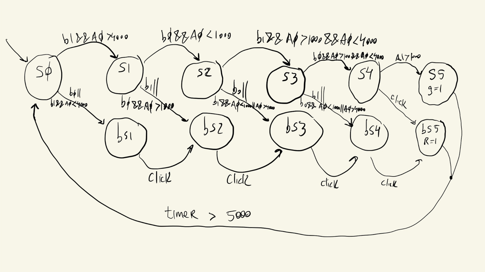
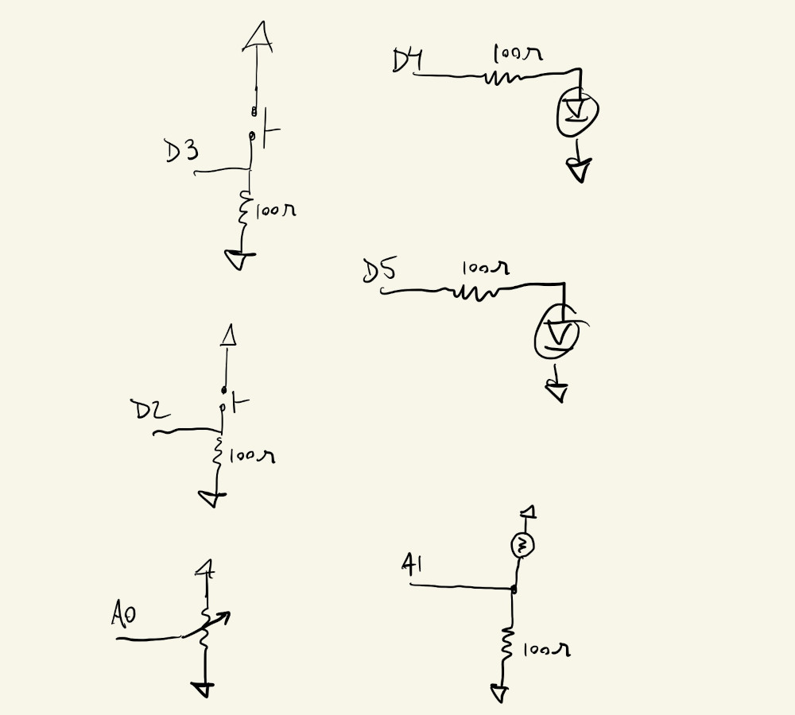
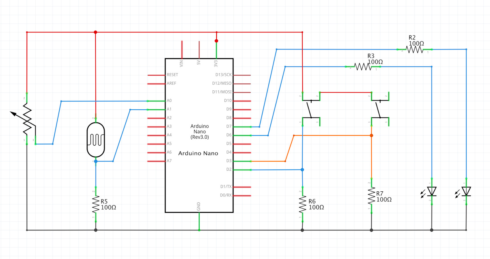
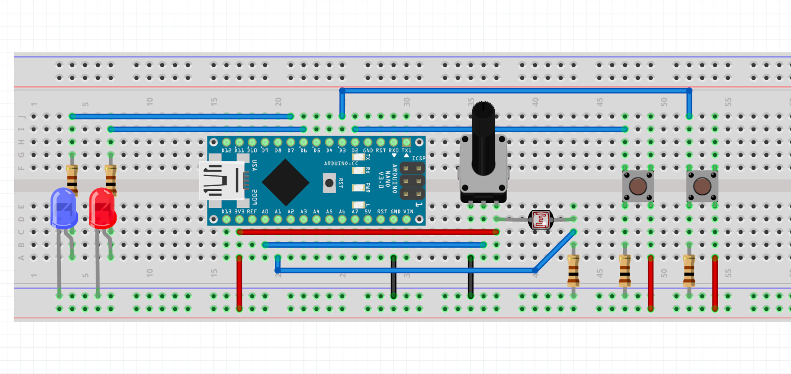
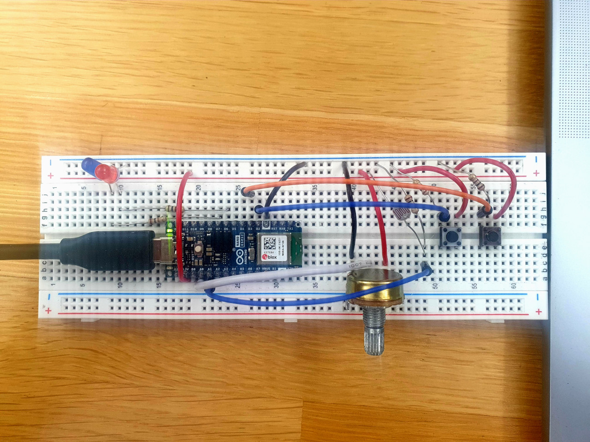
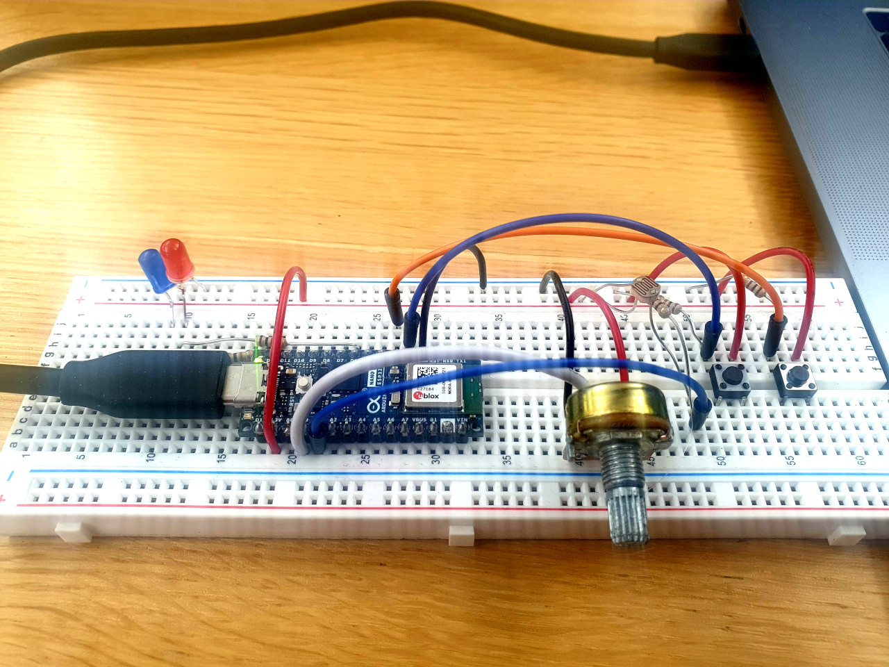

# HW11 : Password Machine

Implemented a password machine with the following successful sequence:
- Turn potentiometer all the way to the right
- Press button 1
- Turn potentiometer all the way to the left
- Press button 0
- Turn potentiometer to the middle
- Press button 1
- Keep potentiometer in the middle
- Press button 0
- Shine light on LDR

## FSM diagram

## Drawing

## Schematic

## Board

## Picture

## Video

